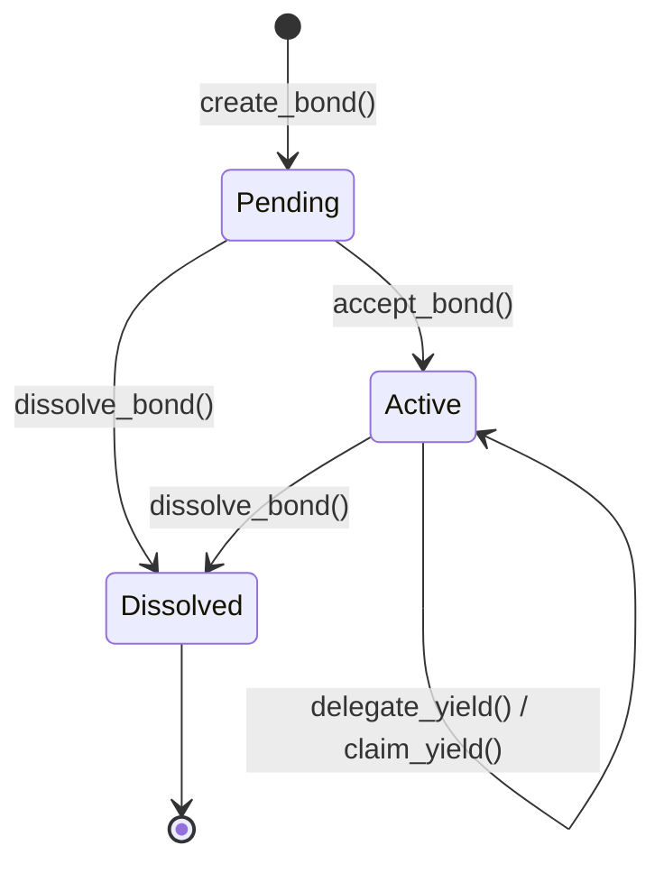

# Nomad Bonding Guide

Turn solo exploration into social nomad life. The **Nomad Bonding System** lets two players form a multi-sig cooperative bond, share passive cosmic essence yields, and build a cooperative exploration partnership on-chain.

---

## Overview

Nomad Bonds are on-chain partnerships between two Stellar addresses. Once created and accepted, bonded players can set up automatic passive yield sharing — a percentage of one player's accrued cosmic essence is automatically claimable by their bonded partner.

### Key Concepts

| Term               | Description                                                          |
| ------------------ | -------------------------------------------------------------------- |
| **Nomad Bond**     | A two-party cooperative link between an initiator and a partner      |
| **Cosmic Essence** | The in-game yield currency earned through exploration                |
| **Yield Delegation** | A configuration that auto-shares a % of one player's essence      |
| **Beneficiary**    | The partner who receives the delegated yield share                   |

---

## Bond Lifecycle



### 1. Create a Bond

The **initiator** proposes a bond, linking it to a specific ship.

```bash
soroban contract invoke --id $CONTRACT_ID \
  --fn create_bond \
  --arg '"GALICE..."' \
  --arg 42 \
  --arg '"GBOB..."' \
  --network futurenet
```

- The bond starts in **Pending** status.
- The initiator must authorize the transaction (`require_auth`).
- A player cannot bond with themselves.

### 2. Accept the Bond

The designated **partner** accepts to activate the bond.

```bash
soroban contract invoke --id $CONTRACT_ID \
  --fn accept_bond \
  --arg '"GBOB..."' \
  --arg 1 \
  --network futurenet
```

- Only the exact partner address recorded in the bond can accept.
- The bond transitions to **Active**.
- Once active, yield delegation can be configured.

### 3. Delegate Yields

Either bonded party can set up passive yield sharing. The **delegator** chooses a percentage (1–100) of their cosmic essence that becomes claimable by the other party.

```bash
soroban contract invoke --id $CONTRACT_ID \
  --fn delegate_yield \
  --arg '"GALICE..."' \
  --arg 1 \
  --arg 40 \
  --network futurenet
```

- The beneficiary is automatically set to the other bonded party.
- Percentage must be between 1 and 100.
- Delegation can be updated by calling `delegate_yield` again.

### 4. Earn and Claim

As the delegator explores nebulas and earns cosmic essence, the beneficiary can claim their share at any time.

```bash
# Check balance
soroban contract invoke --id $CONTRACT_ID \
  --fn get_essence_balance --arg '"GALICE..."'

# Claim yield
soroban contract invoke --id $CONTRACT_ID \
  --fn claim_yield \
  --arg '"GBOB..."' \
  --arg 1 \
  --network futurenet
```

- The claimed amount is `delegator_balance * percentage / 100`.
- The delegator's balance is reduced; the beneficiary's balance is increased.
- Claims can be made multiple times; each claim operates on the current balance.

### 5. Dissolve the Bond

Either the initiator or partner can dissolve the bond at any time.

```bash
soroban contract invoke --id $CONTRACT_ID \
  --fn dissolve_bond \
  --arg '"GALICE..."' \
  --arg 1 \
  --network futurenet
```

- Once dissolved, no further yield claims can be made.
- Existing balances remain — only future sharing is stopped.
- An already-dissolved bond cannot be dissolved again.

---

## Security Model

The bonding system enforces strict access control at every step:

| Action           | Who Can Do It                               |
| ---------------- | ------------------------------------------- |
| `create_bond`    | Initiator (must `require_auth`)             |
| `accept_bond`    | Only the designated partner                 |
| `delegate_yield` | Only initiator or partner of an active bond |
| `claim_yield`    | Only the beneficiary of the delegation      |
| `dissolve_bond`  | Only initiator or partner                   |

**Critical guarantees:**
- An outsider address can never accept, delegate, claim, or dissolve a bond they are not part of.
- The delegator cannot claim their own delegation.
- Yields cannot be claimed on dissolved or pending bonds.
- Self-bonding is rejected at creation time.

---

## Data Model

### Storage Keys

```
BondCounter       → u64            (auto-incrementing ID)
Bond(bond_id)     → NomadBond      (bond metadata)
YieldDel(bond_id) → YieldDelegation (delegation config)
Essence(Address)  → u64            (player's cosmic essence balance)
```

### NomadBond

| Field        | Type        | Description                        |
| ------------ | ----------- | ---------------------------------- |
| `bond_id`    | `u64`       | Unique bond identifier             |
| `initiator`  | `Address`   | Player who proposed the bond       |
| `partner`    | `Address`   | Invited player                     |
| `ship_id`    | `u64`       | Ship NFT the bond is attached to   |
| `status`     | `BondStatus`| `Pending` / `Active` / `Dissolved` |
| `created_at` | `u64`       | Ledger timestamp at creation       |

### YieldDelegation

| Field           | Type      | Description                              |
| --------------- | --------- | ---------------------------------------- |
| `bond_id`       | `u64`     | Bond this delegation belongs to          |
| `delegator`     | `Address` | Who is sharing their essence             |
| `beneficiary`   | `Address` | Who receives the shared portion          |
| `percentage`    | `u32`     | 1–100 share percentage                   |
| `total_yielded` | `u64`     | Running total of all claimed yield       |

---

## Events

The bonding system emits events for off-chain indexing:

| Event                      | Data                                   |
| -------------------------- | -------------------------------------- |
| `(bond, created)`          | `(bond_id, initiator, partner)`        |
| `(bond, accepted)`         | `(bond_id, partner)`                   |
| `(yield, delegatd)`        | `(bond_id, delegator, percentage)`     |
| `(yield, claimed)`         | `(bond_id, claimer, amount)`           |
| `(bond, dissolve)`         | `(bond_id, caller)`                    |

---

## Example: Full Co-op Flow

```
Alice ──── create_bond(ship=42, partner=Bob) ──→ Bond #1 [Pending]
Bob   ──── accept_bond(bond_id=1)            ──→ Bond #1 [Active]
Alice ──── delegate_yield(bond_id=1, pct=40) ──→ 40% → Bob
Alice ──── (explores nebula, earns 2000)     ──→ Alice: 2000
Bob   ──── claim_yield(bond_id=1)            ──→ Bob: 800, Alice: 1200
Alice ──── dissolve_bond(bond_id=1)          ──→ Bond #1 [Dissolved]
```
